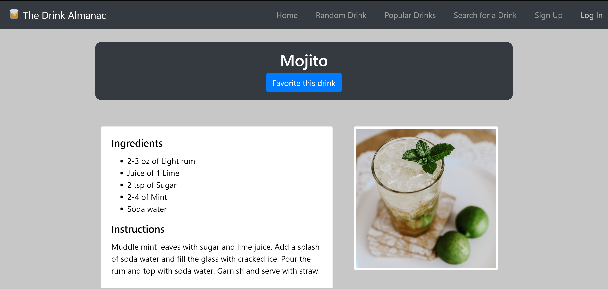

# The Drink Almanac

Soon after moving into my new apartment in Chicago, I went out for drinks and paid way more than I wanted to for even the most basic cocktails. That's when I decided to make [TheDrinkAlmanac.herokuapp.com](https://thedrinkalmanac.herokuapp.com).

The Drink Almanac helps you save money on expensive drinks by showing you the ingredients and steps to make them yourself. If you like a drink and want to easily find it again, you can create a free account and favorite that drink. If you're in the mood to drink but don't have anything specific in mind, you can check out the 10 most popular drinks or cycle through some random ones until something catches your eye.

## Some Technical Details

### Frontend

The Drink Almanac is a Single-Page App created with React and Bootstrap. State management is done entirely with React hooks, but plans are in place to switch over to Redux in the future.

### REST API 

Accounts and favorites are managed through [a REST API](https://thedrinkalmanacapi.herokuapp.com) created with Python and Flask. The API is built on top of a PostgreSQL database. Check out the GitHub repo [here](https://github.com/ryan-kp-miller/The-Drink-Almanac-API).

### Drink Data Source

All of the drink ingredients, instructions, and images are from [The Cocktail DB](https://www.thecocktaildb.com/api.php).
